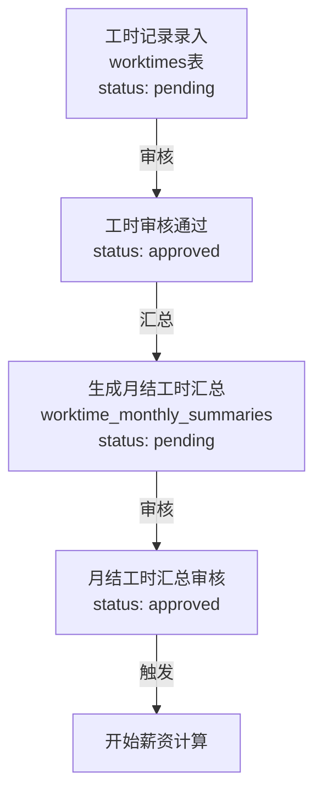

# 月结工资完整操作流程和代码检查报告

## 📋 完整月结操作流程

### 阶段1：工时数据准备 (Data Preparation)



**关键点：**
- 日结工时表 (`worktimes`) 记录每日工作情况
- 月结工时汇总表 (`worktime_monthly_summaries`) 聚合月工时
- 必须先将汇总表审核为 `approved` 状态才能计算薪资

### 阶段2：薪资计算 (Salary Calculation)

**API 端点：**
```
POST /cloud/salaries
{
  "action": "calculate",
  "company_id": "xxx",
  "year": 2024,
  "month": 10,
  "settlement_mode": "monthly"
}
```

**计算流程：**

```
1. 查询条件验证
   ├─ employee_companies (获取结算方式)
   ├─ employees (获取员工信息)
   └─ jobs (获取岗位信息)

2. 时薪获取（优先级）
   ├─ rate_plan.hourly_rate_monthly (工价表 - 月结时薪)
   ├─ rate_plan.daily_rate_monthly / pay_hours_monthly (日薪÷计薪时长)
   ├─ employee_company.hourly_rate (员工关系表)
   ├─ job.hourly_rate (岗位表)
   └─ employee.hourly_rate (员工表)

3. 核心数据取数
   ├─ worktime_monthly_summaries (已审核)
   │  ├─ total_hours (总工时)
   │  ├─ total_days (总天数)
   │  ├─ night_hours (夜班工时)
   │  └─ night_days (夜班天数)
   │
   ├─ rate_plan
   │  ├─ hourly_rate_monthly (时薪)
   │  ├─ night_hourly_rate_monthly (夜班时薪)
   │  ├─ night_daily_rate_monthly (夜班日补贴)
   │  ├─ insurance_daily_deduct (日保险扣减)
   │  └─ insurance_monthly_deduct (月保险扣减)
   │
   └─ employee_companies (加入/离职时间)
      ├─ join_date (加入日期)
      └─ leave_date (离职日期)

4. 核心计算公式
   ├─ basePay = totalHours × hourlyRate
   ├─ nightAllowance = (nightHours × nightHourlyRate) + (nightDays × nightDailyRate)
   ├─ grossPay = basePay + nightAllowance
   ├─ insuranceDeduct = 计算月保险扣减(基于加入/离职时间)
   ├─ tax = (grossPay - insuranceDeduct - 5000) × 10% (如果 > 0)
   └─ netPay = grossPay - insuranceDeduct - tax

5. 保险处理（V2版本）
   ├─ 创建保险账本 (insurance_ledgers)
   ├─ 应用保险扣减 (salary_insurance_deductions)
   └─ 记录扣减明细

6. 数据持久化
   └─ salaries表
      ├─ status: 'calculated'
      ├─ settlement_mode: 'monthly'
      ├─ source_type: 'salary_monthly'
      └─ source_id: `salary_monthly:{employee_id}:{company_id}:{year_month}`
```

### 阶段3：薪资审核 (Approval)

**API 端点：**
```
POST /cloud/salaries
{
  "action": "approve",
  "id": "{薪资记录ID}"
}
```

**审核流程：**
1. 验证薪资记录存在
2. 检查保险一致性 (`assertSalaryInsuranceConsistency`)
3. 更新状态：`calculated` → `approved`
4. 记录审核人和审核时间

### 阶段4：发薪处理 (Payment)

**API 端点：**
```
POST /cloud/salaries
{
  "action": "pay",
  "id": "{薪资记录ID}",
  "pay_date": "2024-10-31"
}
```

**发薪流程：**
1. 验证薪资记录已审核
2. 检查保险一致性
3. 更新状态：`approved` → `paid`
4. 记录发薪日期和操作人

---

## 🔍 代码检查结果

### ❌ 发现的问题

#### 问题1：个税计算固定税率和免征额不合理
**文件：** [cloudfunctions/salary-engine-v2/calculate-salary.js](cloudfunctions/salary-engine-v2/calculate-salary.js#L62-L64)

**问题代码：**
```javascript
function calculateTax(grossPay, insuranceDeduct, threshold = 5000) {
  const taxableIncome = Math.max(0, Number(grossPay || 0) - Number(insuranceDeduct || 0) - Number(threshold || 5000));
  return roundMoney(taxableIncome * 0.1);  // ❌ 固定10%税率
}
```

**问题分析：**
- ❌ 使用固定 10% 税率（实际应该是累进税率）
- ❌ 固定免征额 5000 元（应该是 5000 元个税标准）
- ❌ 没有考虑实际税收政策（最多应该是 10% 起征点以上部分）

**修复建议：**
```javascript
function calculateTax(grossPay, insuranceDeduct, threshold = 5000) {
  const taxableIncome = Math.max(0, Number(grossPay || 0) - Number(insuranceDeduct || 0) - Number(threshold || 5000));
  // 按照累进税率计算（应该根据实际政策调整）
  if (taxableIncome <= 0) return 0;
  if (taxableIncome <= 3000) return roundMoney(taxableIncome * 0.03);
  if (taxableIncome <= 12000) return roundMoney(3000 * 0.03 + (taxableIncome - 3000) * 0.1);
  // ... 更多级别
  return roundMoney(taxableIncome * 0.1);  // 最高级别
}
```

---

#### 问题2：月结汇总数据缺失时计算直接失败，无容错机制
**文件：** [cloudfunctions/salary-engine-v2/calculate-salary.js](cloudfunctions/salary-engine-v2/calculate-salary.js#L213-L217)

**问题代码：**
```javascript
const summaryRes = await db.collection('worktime_monthly_summaries')
  .where({ employee_id, company_id, year_month: yearMonth, status: 'approved' })
  .limit(1)
  .get();

if (!summaryRes.data?.length) throw new Error('未找到已审核的月结工时汇总');  // ❌ 硬失败
```

**问题分析：**
- ❌ 如果找不到汇总数据，整个计算失败，无法生成任何记录
- ❌ 没有跳过或默认处理机制
- ❌ 在批量计算时，一个员工的问题会中断其他员工的计算

**修复建议：**
```javascript
// 选项1：允许生成空汇总
if (!summaryRes.data?.length) {
  console.warn(`[calculate-salary] 员工 ${employee_id} 在 ${yearMonth} 无已审核汇总，使用默认值0`);
  // 使用默认汇总数据
  summary = {
    total_hours: 0,
    total_days: 0,
    night_hours: 0,
    night_days: 0,
    _id: null
  };
} else {
  summary = summaryRes.data[0];
}

// 或选项2：在批量计算中跳过该员工
if (!summaryRes.data?.length) {
  return {
    _error: true,
    employee_id,
    message: '未找到已审核的月结工时汇总'
  };
}
```

---

#### 问题3：夜班补贴计算参数获取不完整
**文件：** [cloudfunctions/salary-engine-v2/calculate-salary.js](cloudfunctions/salary-engine-v2/calculate-salary.js#L53-L56)

**问题代码：**
```javascript
function resolveNightRates(plan, settlementMode) {
  const suffix = settlementMode === 'monthly' ? '_monthly' : '_daily';
  return {
    nightHourlyRate: Number(plan?.[`night_hourly_rate${suffix}`] ?? plan?.night_hourly_rate ?? 0),
    nightDailyRate: Number(plan?.[`night_daily_rate${suffix}`] ?? plan?.night_daily_rate ?? 0)
  };
}
```

**问题分析：**
- ⚠️ 降级逻辑中，夜班参数没有从 employee_company/job/employee 表中获取
- ❌ 如果 rate_plan 中没有夜班参数，直接使用 0，不会搜索其他源

**修复建议：**
```javascript
function resolveNightRates(plan, settlementMode, employeeCompany, job, employee) {
  const suffix = settlementMode === 'monthly' ? '_monthly' : '_daily';
  
  let nightHourlyRate = Number(plan?.[`night_hourly_rate${suffix}`] ?? 0);
  if (!nightHourlyRate) {
    nightHourlyRate = Number(
      plan?.night_hourly_rate ??
      employeeCompany?.night_hourly_rate ??
      job?.night_hourly_rate ??
      employee?.night_hourly_rate ??
      0
    );
  }
  
  let nightDailyRate = Number(plan?.[`night_daily_rate${suffix}`] ?? 0);
  if (!nightDailyRate) {
    nightDailyRate = Number(
      plan?.night_daily_rate ??
      employeeCompany?.night_daily_rate ??
      job?.night_daily_rate ??
      employee?.night_daily_rate ??
      0
    );
  }

  return { nightHourlyRate, nightDailyRate };
}
```

---

#### 问题4：浮点数精度问题 - 某些计算缺少 roundMoney 调用
**文件：** [cloudfunctions/salary-engine-v2/calculate-salary.js](cloudfunctions/salary-engine-v2/calculate-salary.js#L225-L230)

**问题代码：**
```javascript
const totalHours = Number(summary.total_hours || 0);
const totalDays = Number(summary.total_days || 0);
const nightHours = Number(summary.night_hours || 0);
const nightDays = Number(summary.night_days || 0);
const basePay = roundMoney(totalHours * hourlyRate);  // ✓ 正确
const nightAllowance = roundMoney(nightHours * nightHourlyRate + nightDays * nightDailyRate);  // ✓ 正确
const grossPay = roundMoney(basePay + nightAllowance);  // ✓ 正确
```

**问题分析：**
- ✓ 这部分已经正确使用了 roundMoney
- ⚠️ 但在日结计算中，有些中间值没有四舍五入

**示例 (日结)：**
```javascript
records.forEach((record) => {
  const hours = Number(record.total_hours || record.regular_hours || 0);
  totalHours += hours;  // ⚠️ 这里的累加没有roundMoney，可能导致精度问题
  workDays += 1;
  if (record.shift === 'night') { 
    nightHours += hours;  // ⚠️ 同样问题
    nightDays += 1; 
  }
});
```

**修复建议：**
```javascript
records.forEach((record) => {
  const hours = roundMoney(Number(record.total_hours || record.regular_hours || 0));
  totalHours = roundMoney(totalHours + hours);
  workDays += 1;
  if (record.shift === 'night') { 
    nightHours = roundMoney(nightHours + hours);
    nightDays += 1; 
  }
});
```

---

#### 问题5：批量计算中没有事务处理，部分员工失败不会回滚
**文件：** [cloudfunctions/salary-engine-v2/calculate-all.js](cloudfunctions/salary-engine-v2/calculate-all.js#L30-L45)

**问题代码：**
```javascript
const salaryResults = [];
const salaryErrors = [];

// 小批量并发（每批 5 个）避免超出云函数并发限制
const BATCH_SIZE = 5;
for (let i = 0; i < employeeIds.length; i += BATCH_SIZE) {
  const batch = employeeIds.slice(i, i + BATCH_SIZE);
  const batchResults = await Promise.all(batch.map((empId) =>
    salaryCalc.calculateSalary({ employee_id: empId, company_id, year, month, settlement_mode }, operator)
      .catch((err) => ({ _error: true, employee_id: empId, message: err.message }))
  ));
  for (const result of batchResults) {
    if (result._error) salaryErrors.push({ employee_id: result.employee_id, error: result.message });
    else salaryResults.push(result);
  }
}
```

**问题分析：**
- ❌ 没有事务包裹，部分员工成功生成薪资，部分失败
- ❌ 没有原子性保证，可能导致数据不一致
- ❌ 没有重试机制

**修复建议：**
```javascript
const salaryResults = [];
const salaryErrors = [];

try {
  await db.runTransaction(async (transaction) => {
    // 在事务内执行所有计算
    const BATCH_SIZE = 5;
    for (let i = 0; i < employeeIds.length; i += BATCH_SIZE) {
      const batch = employeeIds.slice(i, i + BATCH_SIZE);
      // ... 计算逻辑
    }
  });
} catch (err) {
  console.error('批量计算事务失败:', err);
  // 所有更改都会回滚
  throw err;
}
```

---

#### 问题6：保险扣减 V1 和 V2 版本混用，逻辑复杂且易出错
**文件：** [cloudfunctions/salary-engine-v2/calculate-salary.js](cloudfunctions/salary-engine-v2/calculate-salary.js#L307-L340)

**问题代码：**
```javascript
let finalInsuranceDeduct = monthlyPayload.legacy_insurance_deduct;
let insuranceLedgerId = '';
let insuranceMonth = yearMonth;
let insuranceDeductDetail = {
  mode: insuranceV2Enabled ? 'v2' : 'legacy',
  insurance_month: yearMonth,
  legacy_insurance_deduct: roundMoney(monthlyPayload.legacy_insurance_deduct)
};

if (insuranceV2Enabled) {
  const insuranceSettlement = await prepareMonthlyInsuranceSettlement({...});
  finalInsuranceDeduct = roundMoney(insuranceSettlement.insuranceDeduct);
  // ... 更新其他字段
}
```

**问题分析：**
- ❌ V1（legacy）和 V2 版本并存，逻辑复杂
- ❌ 如果 V2 开关未启用，就使用 V1 逻辑，但 V1 逻辑可能有缺陷
- ❌ 保险扣减信息存储在 JSON 字符串中，查询困难
- ❌ 没有版本迁移策略

**修复建议：**
```javascript
// 统一使用 V2 逻辑
if (insuranceV2Enabled) {
  const insuranceSettlement = await prepareMonthlyInsuranceSettlement({...});
  finalInsuranceDeduct = insuranceSettlement.insuranceDeduct;
  // ... 存储详细信息
} else {
  // 明确的备选方案，而不是隐式的 legacy 逻辑
  console.warn('[calculate-salary] Insurance V2 未启用，使用简化扣减');
  finalInsuranceDeduct = calculateInsuranceDeduct(plan, year, month, joinDate, leaveDate);
}
```

---

#### 问题7：Web 端 UI 月结操作流程不完整
**文件：** [web/src/views/Salary/Index.vue](web/src/views/Salary/Index.vue#L300-L350)

**问题分析：**
- ❌ 月结发薪 Tab 中，没有 **工时汇总审核** 的功能
- ⚠️ 用户需要手动跳转到工时管理模块去审核工时汇总
- ❌ 没有向用户提示 "需要先审核工时汇总才能计算薪资"
- ❌ 如果工时汇总未审核，计算会直接失败，没有友好的错误提示

**修复建议：**
```vue
<el-tab-pane label="月结发薪" name="monthly">
  <!-- 添加工时汇总审核快捷链接 -->
  <el-alert
    type="info"
    title="友情提示"
    description="请先前往「工时管理」->「月结汇总」审核本月工时数据，然后再执行薪资计算"
    closable
    show-icon
  />
  
  <!-- 添加工时汇总查看功能 -->
  <el-card title="本月工时汇总状态">
    <el-button @click="handleCheckMonthlySummaryStatus">检查工时汇总状态</el-button>
    <el-table :data="monthlySummaryList" v-if="monthlySummaryList.length">
      <el-table-column prop="employee_name" label="员工" />
      <el-table-column prop="total_hours" label="工时" />
      <el-table-column prop="status" label="状态">
        <template #default="{ row }">
          <el-tag :type="row.status === 'approved' ? 'success' : 'warning'">
            {{ row.status }}
          </el-tag>
        </template>
      </el-table-column>
    </el-table>
  </el-card>
</el-tab-pane>
```

---

#### 问题8：税务处理中没有考虑地方政策差异
**文件：** [cloudfunctions/salary-engine-v2/calculate-salary.js](cloudfunctions/salary-engine-v2/calculate-salary.js#L62-L64)

**问题分析：**
- ❌ 个税计算没有考虑不同地区的政策差异
- ❌ 免征额写死为 5000，没有考虑可能的政策调整
- ❌ 没有配置表支持不同企业的税收政策配置

**修复建议：**
```javascript
// 在 rate_plans 表中添加税收配置字段
{
  tax_threshold: 5000,  // 免征额
  tax_rates: [          // 累进税率表
    { min: 0, max: 3000, rate: 0.03 },
    { min: 3000, max: 12000, rate: 0.1 },
    { min: 12000, max: 25000, rate: 0.2 },
    // ...
  ]
}

// 计算时查询配置
async function calculateTaxWithConfig(grossPay, insuranceDeduct, ratePlan) {
  const threshold = ratePlan?.tax_threshold || 5000;
  const taxableIncome = Math.max(0, grossPay - insuranceDeduct - threshold);
  
  const taxRates = ratePlan?.tax_rates || DEFAULT_TAX_RATES;
  let tax = 0;
  for (const rate of taxRates) {
    if (taxableIncome > rate.min) {
      const taxableInThisRange = Math.min(taxableIncome, rate.max) - rate.min;
      tax += taxableInThisRange * rate.rate;
    }
  }
  return roundMoney(tax);
}
```

---

### ⚠️ 潜在风险

#### 风险1：数据库查询性能
- 批量计算时，每个员工会执行多次数据库查询
- 没有建立适当的数据库索引
- 大企业（>1000人）计算可能超时

**建议：**
```javascript
// 在 worktime_monthly_summaries 上建立复合索引
db.createIndex({
  'employee_id': 1,
  'company_id': 1,
  'year_month': 1,
  'status': 1
})
```

#### 风险2：并发问题
- 多个管理员同时计算同一企业同一月份的薪资
- 可能产生重复的薪资记录或数据覆盖

**建议：**
```javascript
// 使用业务级锁
async function calculateWithLock(company_id, year, month) {
  const lockKey = `salary_calculation:${company_id}:${year}:${month}`;
  const locked = await db.collection('system_locks')
    .where({ lock_key: lockKey, expires_at: db.command.gt(new Date()) })
    .limit(1)
    .get();
  
  if (locked.data?.length) {
    throw new Error('该企业该月份薪资正在计算中，请稍候');
  }
  
  // 创建锁
  const lockId = await db.collection('system_locks').add({
    lock_key: lockKey,
    created_at: new Date(),
    expires_at: new Date(Date.now() + 5 * 60 * 1000)  // 5分钟过期
  });
  
  try {
    // 执行计算
    return await calculateSalary(...);
  } finally {
    // 释放锁
    await db.collection('system_locks').doc(lockId).remove();
  }
}
```

#### 风险3：审核数据一致性检查不足
- `assertSalaryInsuranceConsistency` 函数实现未找到
- 无法验证保险账本和薪资数据的一致性
- 发薪时可能产生保险扣减与账本不匹配

---

## ✅ 建议的改进清单

| 优先级 | 问题 | 建议改进 | 影响 |
|------|------|--------|------|
| 🔴 高 | 个税计算固定税率 | 实现累进税率和配置化 | 合规性 |
| 🔴 高 | 汇总缺失硬失败 | 添加容错和日志 | 稳定性 |
| 🔴 高 | 批量计算无事务 | 添加事务包裹 | 一致性 |
| 🟡 中 | 保险版本混用 | 统一迁移到V2 | 可维护性 |
| 🟡 中 | UI流程不完整 | 添加汇总审核功能 | 用户体验 |
| 🟡 中 | 浮点数精度 | 统一使用roundMoney | 准确性 |
| 🟡 中 | 并发冲突 | 实现业务级锁 | 稳定性 |
| 🟢 低 | 性能优化 | 建立数据库索引 | 性能 |

---

## 📊 数据流向图

```
flowchart TD
    subgraph Input["📥 输入数据"]
        A["employee表<br/>员工信息"]
        B["employee_companies表<br/>关联关系"]
        C["worktime_monthly_summaries表<br/>（已审核）"]
        D["rate_plans表<br/>工价方案"]
    end
    
    subgraph Process["🔧 处理过程"]
        E["时薪获取<br/>（多级降级）"]
        F["夜班参数获取"]
        G["工时数据提取"]
        H["保险扣减计算"]
        I["个税计算"]
    end
    
    subgraph Calc["📐 核心公式"]
        J["basePay = totalHours × hourlyRate"]
        K["nightAllowance = <br/>nightHours × nightHourlyRate +<br/>nightDays × nightDailyRate"]
        L["grossPay = basePay + nightAllowance"]
        M["netPay = grossPay - insurance - tax"]
    end
    
    subgraph Output["📤 输出数据"]
        N["salaries表<br/>status: calculated"]
        O["insurance_ledgers表<br/>保险账本"]
        P["salary_insurance_deductions表<br/>扣减明细"]
    end
    
    A --> E
    B --> E
    D --> E
    B --> H
    D --> H
    C --> G
    E --> Calc
    F --> Calc
    G --> Calc
    H --> Calc
    I --> Calc
    Calc --> J
    Calc --> K
    J --> L
    K --> L
    L --> M
    M --> N
    H --> O
    H --> P
```

---

## 📱 操作流程总结

### 快速检查清单

- [ ] **计算前检查**
  - [ ] 工时汇总是否已审核？
  - [ ] 工价方案是否已配置？
  - [ ] 员工关联是否完整？

- [ ] **计算过程**
  - [ ] 是否有错误日志？
  - [ ] 薪资数据是否生成？
  - [ ] 保险账本是否创建？

- [ ] **审核发放**
  - [ ] 薪资明细是否正确？
  - [ ] 税务是否合规？
  - [ ] 保险扣减是否准确？

### 常见问题排查

**Q: 计算薪资失败"未找到已审核的月结工时汇总"**
- A: 需要先在「工时管理」->「月结汇总」中审核工时汇总数据

**Q: 同一员工薪资数据重复**
- A: 清理已存在的薪资记录后重新计算，或检查并发锁机制

**Q: 发薪金额与工时不符**
- A: 检查时薪配置是否正确，检查是否存在夜班补贴配置

**Q: 保险扣减金额不对**
- A: 检查加入/离职日期是否准确，确认保险配置是否启用V2版本

