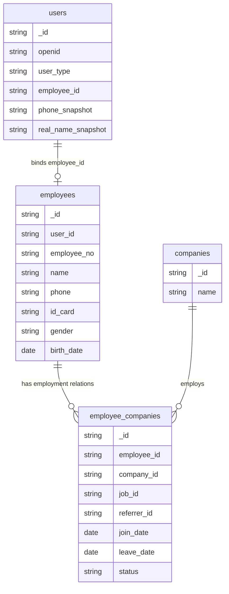

# 数据库只读审计报告

审计日期：2026-05-13  
环境：cloud1-5glojms9a83c3457  
审计方式：CloudBase MCP 只读查询  
涉及集合：`users`、`employees`、`employee_companies`

## 1. 审计边界

本次只做只读审计，没有执行任何数据库写入、删除、部署或结构变更。

已执行的只读动作：

- 查询 CloudBase 登录与环境绑定状态
- 读取 `users`、`employees`、`employee_companies` 数据样本与集合总量
- 对发现的高风险样本进行定向复查

未执行的动作：

- 未调用 `writeNoSqlDatabaseContent`
- 未调用 `writeNoSqlDatabaseStructure`
- 未更新或部署云函数
- 未删除、合并、修正任何数据

## 2. 集合规模

| 集合 | 当前数量 | 定位 |
| --- | ---: | --- |
| `users` | 1773 | 小程序和 Web 端统一用户账号表 |
| `employees` | 367 | 员工主档 |
| `employee_companies` | 383 | 员工与企业的在职关系表 |

说明：MCP 返回长列表时会截断输出，因此本报告中只有通过定向查询复核过的样本被标记为“已确认”。完整重复计数建议下一步通过专门的只读审计函数返回聚合结果。

## 3. 已确认高风险问题

### 3.1 `employees` 存在重复员工主档

同一身份证号、姓名、手机号、`user_id` 出现两条员工主档。

| 字段 | 记录 A | 记录 B |
| --- | --- | --- |
| `_id` | `611e990a6a013c6e01d84cbd63c5825a` | `9756e7616a013c6e01d243b916f47e36` |
| 姓名 | 龚诗辰 | 龚诗辰 |
| 手机号 | `19215146843` | `19215146843` |
| 身份证号 | `32130220081205281X` | `32130220081205281X` |
| `user_id` | `611e990a69fedd21019a25b91546cd6c` | `611e990a69fedd21019a25b91546cd6c` |
| `employee_no` | `EP202605110783` | `EP202605119053` |
| `company_id` | `6b0b394169ede6a600ae0db3790fddef` | `6b0b394169ede6a600ae0db3790fddef` |
| `join_date` | `2026-05-11T02:18:20.047Z` | `2026-05-11T02:18:20.082Z` |
| `leave_date` | `2026-05-10` | 空 |
| `status` | `resigned` | `active` |

判断：

- 这是员工主档层面的重复，不只是关系表重复。
- 两条记录高度相似，且创建时间非常接近。
- 初步看可以把 `active` 记录作为保留候选，把 `resigned` 记录作为待合并候选，但在正式处理前必须确认是否有关联业务数据引用旧 `_id`。

风险等级：P0

### 3.2 `employee_companies` 存在状态与离职日期冲突

样本一：`employee_id = 71fe4ab869bcc4d700d9e48513fefcb4`

| `_id` | `company_id` | `join_date` | `leave_date` | `status` |
| --- | --- | --- | --- | --- |
| `9f5d149069bcc4d800d9afff27cd9291` | `b3c6c3d569bcb98b00df161941cb67fb` | `2026-03-20T03:53:59.758Z` | `2026-03-25` | `active` |
| `9756e76169fd4f430168b2852e1a31e1` | `dde8ef4869c63ed901d2ae95623d47ab` | `2026-05-08` | `2026-05-08` | `active` |

样本二：`employee_id = 9f5d149069c0a73201354cb00489d204`

| `_id` | `company_id` | `join_date` | `leave_date` | `status` |
| --- | --- | --- | --- | --- |
| `c25002a969c0a732013742634e967488` | `b3c6c3d569bcb98b00df161941cb67fb` | `2026-05-08` | `2026-05-08` | `active` |
| `948392db69fd55c9016c25cb122ae75d` | `dde8ef4869c63ed901d2ae95623d47ab` | `2026-05-08` | `2026-05-08` | `active` |

判断：

- 关系记录标记为 `active`，但 `leave_date` 已经存在，语义冲突。
- 同一员工可能在多家公司出现关系记录，这本身不一定错误；错误点是“已离职日期”和“在职状态”同时存在。
- 若业务规则要求一个员工同一时间只能有一个在职企业，则还需要进一步审计“同一 employee_id 多条 active 关系”。

风险等级：P1

### 3.3 `users` 存在同一身份证号对应多个用户账号

查询条件：`id_card = 321321198703143164`

| `_id` | 姓名 | 手机号 | `user_type` | `employee_id` | `employee_no` |
| --- | --- | --- | --- | --- | --- |
| `dde8ef4869c0a70d013a531a274943a1` | 白小娟 | `19352765001` | `admin` | `9f5d149069c0a73201354cb00489d204` | `EP202603233443` |
| `da3d566169c7273901e1879872a0c5a0` | 候选人0985 | `19550490985` | `candidate` | 空 | 空 |

判断：

- 同一身份证号对应了两个不同用户账号，且一个是 `admin`，一个是 `candidate`。
- 这类数据不能直接自动合并，需要先确认是否为录入错误、测试数据、候选人转员工残留，或身份证号被误填。

风险等级：P1

## 4. 结构性冗余

### 4.1 `employees` 同时承担了主档和在职关系

当前 `employees` 中仍存在明显属于“在职关系”的字段，例如：

- `company_id`
- `job_id`
- `referrer_id`
- `join_date`
- `leave_date`
- `status`

这些字段与 `employee_companies` 的职责重叠，导致同一业务事实可能在两个集合中重复维护。

建议目标：

- `employees` 只保留员工主档字段：姓名、手机号、身份证、性别、出生日期、用户绑定、员工编号等。
- `employee_companies` 承担企业归属、岗位、入职、离职、状态、推荐人等关系字段。
- 页面和云函数需要企业上下文时，通过 `employee_companies.employee_id -> employees._id` 关联读取。

风险等级：P2

### 4.2 `users` 与 `employees` 存在身份字段重复

`users` 和 `employees` 都包含姓名、手机号、身份证号一类字段。考虑到 `users` 是账号表、`employees` 是员工主档，两边可以保留不同层级的数据职责：

- `users`：登录身份、账号类型、openid、头像、昵称、认证状态、绑定的员工主档 ID。
- `employees`：实名主档、手机号、身份证号、员工编号。

建议：

- 如果一个用户已绑定员工主档，业务展示员工实名信息时优先读取 `employees`。
- `users` 中的实名字段仅作为注册认证快照或兼容字段，后续逐步减少写入依赖。
- 身份证号不建议在 `users` 与 `employees` 长期双写。

风险等级：P2

## 5. 数据质量问题

只读样本中观察到以下质量问题，需要完整扫描确认数量：

- `employees.user_id` 存在空字符串，说明员工主档未绑定用户账号。
- `employees.id_card` 存在空字符串，无法用身份证号做唯一识别。
- 手机号存在明显无效值，例如 `000`、`0000`、`1111`、`111111111` 等。
- 部分姓名、手机号、身份证号可能在 `users` 和 `employees` 中不一致。

风险等级：P2

## 6. 建议的数据模型职责

## 7. 下一步只读审计清单

建议下一步仍保持只读，先拿到完整计数与样本，再进入修复方案。

需要统计：

1. `employees` 中 `id_card != ""` 的身份证重复组数量和样本。
2. `employees` 中 `user_id != ""` 的用户绑定重复组数量和样本。
3. `employees` 中 `phone + name` 重复但身份证为空的疑似重复组。
4. `employee_companies` 中 `status = active` 且 `leave_date` 非空的记录数量。
5. `employee_companies` 中同一 `employee_id` 多条 `active` 关系的数量。
6. `users` 中 `id_card != ""` 的身份证重复组数量和样本。
7. `users.employee_id` 与 `employees.user_id` 双向绑定不一致的数量。
8. `users`、`employees` 手机号格式异常数量。

## 8. 建议执行路径

### 阶段 A：精确只读审计

新增或复用一个只读审计入口，返回聚合后的数量和样本，而不是拉取全量明细。

可选方案：

- 方案一：复用现有云函数中的 dry-run 能力，先检查代码，确认 dry-run 不写库后通过 MCP 调用。
- 方案二：新增一个临时只读审计云函数，例如 `database-audit`，只查询并返回报告数据。该方案需要部署代码，需单独确认后执行。

### 阶段 B：生成修复清单

基于精确审计结果生成三类清单：

- 自动修复候选：重复员工主档、明确状态冲突、空冗余字段。
- 人工确认清单：身份证冲突、账号类型不同、手机号姓名不一致。
- 延后处理清单：历史快照字段、兼容字段、低风险冗余字段。

### 阶段 C：分批修复

修复顺序建议：

1. 先修 `employee_companies` 状态与离职日期冲突。
2. 再修 `employees` 重复主档。
3. 再修 `users` 与 `employees` 的绑定关系。
4. 最后做字段职责收敛和代码读写路径调整。

## 9. 当前结论

当前数据库确实存在重复与冗余，主要不是单一表的问题，而是三层职责边界没有完全收敛：

- `users` 同时存账号信息和实名信息。
- `employees` 同时存员工主档和在职关系。
- `employee_companies` 已经存在，但部分关系状态与日期不一致。

本次已确认至少存在：

- 员工主档重复记录。
- 在职关系状态与离职日期冲突。
- 用户账号身份证号重复，且跨不同用户类型。

建议不要直接删除数据。下一步应先做精确聚合审计，输出完整重复组和冲突组，再按“自动修复候选”和“人工确认清单”分批处理。
