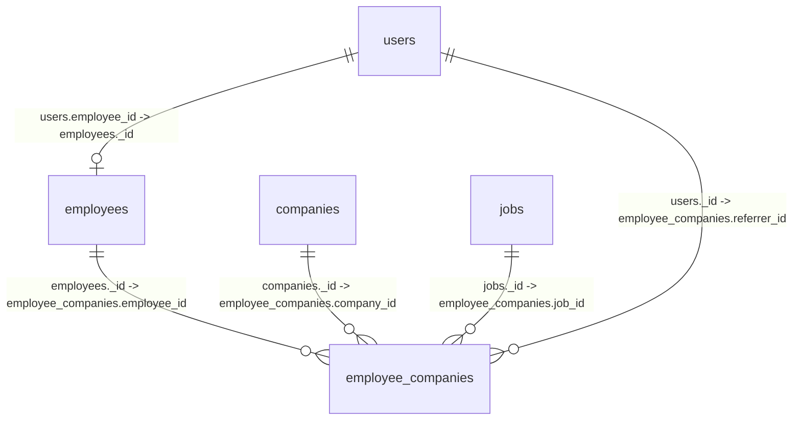

# 核心用户与员工数据模型边界设计

更新时间：2026-05-13

## 1. 设计目标

本设计先固定 `users`、`employees`、`employee_companies` 三张核心表的字段职责和关系边界，后续所有入职、登录、员工列表、工时、薪资、保险、提成等功能都按这个模型收敛。

核心原则：

- `users` 是账号，不是员工档案。
- `employees` 是自然人员工主档，不绑定某一次入职企业。
- `employee_companies` 是员工和企业之间的一段在职关系。
- 姓名、手机号、身份证的主数据只放在 `employees`。
- 企业、岗位、入职、离职、推荐人、工价只放在 `employee_companies`。
- 页面展示所需的企业名、岗位名、推荐人名由查询时关联补齐，不作为主数据多处写入。

## 2. 总体关系



标准链路：

```text
登录账号 users
  -> 绑定员工主档 employees
  -> 当前/历史在职关系 employee_companies
  -> 企业 companies / 岗位 jobs / 工价 rate_plans
```

## 3. `users`：统一账号表

### 3.1 定位

`users` 只负责小程序和 Web 端登录账号、权限、身份入口和员工绑定。

它回答的问题：

- 这个人能不能登录？
- 这个账号是什么类型？
- 这个账号绑定了哪个员工主档？
- 这个账号有什么后台权限？

它不回答的问题：

- 这个员工身份证是多少？
- 这个员工在哪个企业上班？
- 这个员工当前岗位、工价、推荐人是什么？

### 3.2 主字段设计

| 字段 | 类型 | 必填 | 说明 |
| --- | --- | --- | --- |
| `_id` | string | 是 | 用户账号 ID |
| `openid` | string | 小程序账号必填 | 微信小程序登录标识 |
| `unionid` | string | 否 | 微信开放平台统一标识 |
| `phone` | string | 否 | 登录手机号或账号手机号。不是员工手机号主档 |
| `name` | string | 否 | 昵称或展示名 |
| `real_name_snapshot` | string | 否 | 认证或注册时的实名快照，兼容字段 |
| `avatar` | string | 否 | 头像 |
| `user_type` | string | 是 | `candidate` / `employee` / `admin` |
| `role` | string | 否 | 后台角色：`gm` / `deputy` / `hr` / `external` / `finance` 等 |
| `status` | string | 是 | `normal` / `disabled` |
| `employee_id` | string | 否 | 绑定的员工主档 ID |
| `employee_no_snapshot` | string | 否 | 员工编号展示快照，兼容字段 |
| `last_login` | date | 否 | 最近登录时间 |
| `created_at` | date | 是 | 创建时间 |
| `updated_at` | date | 是 | 更新时间 |

### 3.3 兼容字段

| 字段 | 处理方式 |
| --- | --- |
| `real_name` | 兼容读取，后续统一迁移为 `real_name_snapshot` 或通过 `employees.name` 展示 |
| `employee_no` | 兼容读取，后续统一迁移为 `employee_no_snapshot` |
| `id_card` | 仅保留历史兼容，不再作为新增主写字段 |
| `gender` | 候选人阶段可保留；员工实名性别以 `employees.gender` 为准 |

### 3.4 禁止新增写入

`users` 后续禁止新增或继续主写以下员工主档/关系字段：

- `id_card`
- `company_id`
- `company_name`
- `job_id`
- `job_name`
- `join_date`
- `leave_date`
- `referrer_id`
- `referrer_name`
- `source_referrer_id`
- `source_referrer_name`

### 3.5 约束

- `openid` 在同一个小程序端逻辑唯一。
- `phone` 不建议全局唯一，因为可能存在测试账号、候选人残留、账号合并前过渡。
- `employee_id` 逻辑上应唯一：一个员工主档最多绑定一个有效用户账号。
- `admin` 账号可以不绑定 `employee_id`，但如果绑定，也必须指向真实 `employees._id`。

## 4. `employees`：员工自然人主档

### 4.1 定位

`employees` 负责自然人维度的员工档案，一人一档。

它回答的问题：

- 这个员工是谁？
- 员工实名、手机号、身份证、员工编号是什么？
- 员工是否被合并、是否黑名单？
- 员工的银行卡、紧急联系人、合同信息是什么？

它不回答的问题：

- 员工现在在哪个企业上班？
- 员工在哪个岗位、什么工价？
- 这次入职是谁推荐的？
- 员工某段时间是否离职？

### 4.2 主字段设计

| 字段 | 类型 | 必填 | 说明 |
| --- | --- | --- | --- |
| `_id` | string | 是 | 员工主档 ID |
| `user_id` | string | 否 | 绑定的用户账号 ID。清理完成后逻辑唯一 |
| `employee_no` | string | 是 | 员工编号，逻辑唯一 |
| `name` | string | 是 | 员工真实姓名 |
| `phone` | string | 否 | 员工主手机号 |
| `id_card` | string | 否 | 员工身份证号。清理完成后非空值逻辑唯一 |
| `gender` | number/string | 否 | 性别 |
| `birth_date` | date | 否 | 出生日期，可由身份证解析后缓存 |
| `bank_name` | string | 否 | 开户行 |
| `bank_account` | string | 否 | 银行卡号，敏感字段 |
| `bank_account_name` | string | 否 | 开户名 |
| `bank_card_last4` | string | 否 | 银行卡后四位 |
| `emergency_contact` | string | 否 | 紧急联系人 |
| `emergency_phone` | string | 否 | 紧急联系人电话 |
| `is_blacklisted` | boolean | 否 | 是否黑名单 |
| `blacklist_reason` | string | 否 | 黑名单原因 |
| `merged_into_employee_id` | string | 否 | 如果该档案被合并，指向保留员工 ID |
| `merge_reason` | string | 否 | 合并原因 |
| `created_at` | date | 是 | 创建时间 |
| `updated_at` | date | 是 | 更新时间 |

### 4.3 员工状态处理

建议 `employees` 不再保存跟企业关系强绑定的 `status`。

兼容期可保留 `status`，但只能作为聚合状态缓存：

| `employees.status` | 含义 | 来源 |
| --- | --- | --- |
| `active` | 至少存在一条有效在职关系 | 从 `employee_companies` 聚合 |
| `inactive` | 没有有效在职关系，但不是黑名单或合并档案 | 从 `employee_companies` 聚合 |
| `merged` | 已合并到其他员工主档 | `merged_into_employee_id` 非空 |

历史的 `probation`、`regular`、`resigned` 属于某次雇佣关系状态，应迁移到 `employee_companies.employment_status` 或 `employee_companies.status`。

### 4.4 禁止新增写入

`employees` 后续禁止新增或继续主写以下关系字段：

- `company_id`
- `company_name`
- `job_id`
- `job_name`
- `join_date`
- `leave_date`
- `departure_date`
- `departure_reason`
- `referrer_id`
- `referrer_name`
- `source_referrer_id`
- `source_referrer_name`
- `recommender_id`
- `recommender_name`
- `hourly_rate`
- `salary_type`
- `settlement_mode`
- `rate_plan_id`
- `contract_status`
- `contract_no`
- `contract_sequence`
- `contract_signed_at`
- `contract_start`
- `contract_end`
- `contract_type`

兼容期这些字段可以读，但新增写入必须切到 `employee_companies`。

### 4.5 约束

- `employee_no` 逻辑唯一。
- `user_id` 非空时逻辑唯一。
- `id_card` 非空时逻辑唯一，当前重复清理完成后启用。
- `phone + name` 可作为无身份证场景下的弱匹配条件，不能作为强唯一键。
- 被合并档案不物理删除，只设置 `merged_into_employee_id`。

## 5. `employee_companies`：员工企业关系表

### 5.1 定位

`employee_companies` 负责员工与企业之间的一段雇佣、派遣或入职关系。一个员工可以有多条历史关系，也可以按业务规则允许多条当前有效关系。

它回答的问题：

- 员工在哪个企业？
- 哪个岗位、哪套工价、什么结算方式？
- 哪天入职、哪天离职？
- 这段关系是谁推荐的？
- 这段关系是否已签约、合同编号是多少？
- 工时、薪资、保险应该归属到哪段关系？

### 5.2 主字段设计

| 字段 | 类型 | 必填 | 说明 |
| --- | --- | --- | --- |
| `_id` | string | 是 | 员工企业关系 ID |
| `employee_id` | string | 是 | 指向 `employees._id` |
| `company_id` | string | 是 | 指向 `companies._id` |
| `job_id` | string | 否 | 指向 `jobs._id` |
| `rate_plan_id` | string | 否 | 指向工价方案 |
| `salary_type` | string | 否 | `monthly` / `daily` / `hourly` / `piece` |
| `settlement_mode` | string | 否 | `monthly` / `daily` / `piece` |
| `hourly_rate` | number | 否 | 兼容字段，优先从 `rate_plan` 取 |
| `join_date` | date/string | 是 | 本段关系开始日期 |
| `leave_date` | date/string | 否 | 本段关系结束日期 |
| `status` | string | 是 | 关系状态，见下方枚举 |
| `contract_status` | string | 是 | 签约状态：`unsigned` / `signed` |
| `contract_no` | string | 否 | 签署合同编号，未签约为空 |
| `contract_sequence` | number | 否 | 企业维度合同流水号 |
| `contract_signed_at` | date/string | 否 | 人工确认签约时间 |
| `contract_start` | date/string | 否 | 本段关系合同开始日期 |
| `contract_end` | date/string | 否 | 本段关系合同结束日期 |
| `contract_type` | string | 否 | 本段关系合同类型 |
| `referrer_id` | string | 否 | 推荐人用户 ID 或员工 ID，按业务统一定义 |
| `referrer_type` | string | 否 | `user` / `employee` / `external` |
| `source_channel` | string | 否 | 来源渠道 |
| `created_by` | string | 否 | 创建人 |
| `created_at` | date | 是 | 创建时间 |
| `updated_at` | date | 是 | 更新时间 |

### 5.3 可选快照字段

原则上不保存名称主数据，但可以保存历史展示快照。快照字段必须带 `_snapshot` 后缀：

| 字段 | 说明 |
| --- | --- |
| `company_name_snapshot` | 入职时企业名称快照 |
| `job_name_snapshot` | 入职时岗位名称快照 |
| `referrer_name_snapshot` | 入职时推荐人名称快照 |
| `rate_plan_name_snapshot` | 入职时工价方案名称快照 |

要求：

- 快照由后端统一生成。
- 前端不直接提交快照字段。
- 查询展示优先实时关联 `companies/jobs/users`，历史凭证场景才使用快照。

### 5.4 推荐字段统一

历史字段：

- `source_referrer_id`
- `source_referrer_name`
- `referrer_id`
- `referrer_name`
- `recommender_id`
- `recommender_name`

新模型统一为：

- `referrer_id`
- `referrer_type`
- `referrer_name_snapshot`
- `source_channel`

兼容映射：

| 旧字段 | 新字段 |
| --- | --- |
| `source_referrer_id` | `referrer_id` |
| `recommender_id` | `referrer_id` |
| `referrer_name` | `referrer_name_snapshot` |
| `source_referrer_name` | `referrer_name_snapshot` |
| `recommender_name` | `referrer_name_snapshot` |

### 5.5 合同编号规则

合同属于员工和企业之间的一段在职关系，统一存放在 `employee_companies`，不再存放在 `employees`。

- 未签约：`contract_status = unsigned`，`contract_no` 为空，页面显示 `-`。
- 已签约：人工点击签约后写入 `contract_status = signed`、`contract_no`、`contract_sequence`、`contract_signed_at`。
- 编号规则：一个企业一套连续序列，格式为 `HT-{企业编码}-{5位流水}`，例如 `HT-SQWK-00001`。
- 企业编码优先取 `companies.company_code`，没有则取企业 ID 后 6 位兜底。
- 同一个员工如果有多段 `employee_companies` 关系，可以产生多份合同和多个合同编号。

### 5.6 状态枚举

建议统一 `employee_companies.status`：

| 状态 | 含义 | 规则 |
| --- | --- | --- |
| `active` | 当前有效在职关系 | `leave_date` 为空或大于等于今天 |
| `left` | 已离职或关系结束 | `leave_date` 小于今天 |
| `pending` | 已创建但未正式生效 | 入职日期晚于今天或待确认 |
| `suspended` | 暂停关系 | 临时停用，不等于离职 |
| `cancelled` | 误建或取消 | 不参与工时薪资 |

禁止状态冲突：

- `status = active` 时，`leave_date` 不应早于今天。
- `status = left` 时，必须有 `leave_date`。
- 同一个 `employee_id + company_id + join_date` 不应重复。

### 5.6 约束

- `employee_id` 必须存在于 `employees`。
- `company_id` 必须存在于 `companies`。
- `job_id` 非空时必须属于同一个 `company_id`。
- 不建议唯一限制 `employee_id + company_id`，因为同一员工可能离职后再次入职同一企业。
- 建议逻辑唯一：`employee_id + company_id + join_date`。
- 如果业务不允许一人同时多企业在职，则额外限制同一 `employee_id` 只能有一条 `active`。
- 如果业务允许一人多企业在职，则限制同一 `employee_id + company_id` 只能有一条 `active`。

## 6. 读取边界

### 6.1 登录后获取身份

输入：`openid` 或登录手机号。

读取：

1. 查 `users`。
2. 如果 `users.employee_id` 存在，查 `employees`。
3. 查 `employee_companies` 当前有效关系。

返回：

- 账号信息来自 `users`。
- 员工实名信息来自 `employees`。
- 企业、岗位、工价来自 `employee_companies` 及其关联表。

### 6.2 员工列表

主表：`employees`

关联：

- 当前关系：`employee_companies` 中有效关系。
- 企业名称：`companies.name`
- 岗位名称：`jobs.position`

禁止：

- 直接用 `employees.company_id` 过滤企业。
- 直接用 `employees.job_name` 展示岗位。

### 6.3 员工详情

返回三块：

- `profile`：`employees` 主档。
- `current_relations`：当前有效 `employee_companies`。
- `history_relations`：全部历史 `employee_companies`。

### 6.4 工时、薪资、保险

优先使用：

```text
employee_company_id
```

如果历史数据没有 `employee_company_id`，用以下条件解析：

```text
employee_id + company_id + work_date
```

解析规则：

- `join_date <= work_date`
- `leave_date` 为空或 `leave_date >= work_date`
- `status` 不为 `cancelled`

禁止继续回退到：

- `employees.company_id`
- `employees.job_id`
- `employees.hourly_rate`

## 7. 写入边界

### 7.1 候选人注册

写 `users`：

- `openid`
- `phone`
- `name`
- `user_type = candidate`
- `status = normal`

如果采集实名信息，只作为候选人认证快照；转员工时必须进入 `employees`。

### 7.2 办理入职

写入顺序：

1. 根据 `user_id`、`id_card`、`phone + name` 查找可复用 `employees`。
2. 不存在则创建 `employees` 主档。
3. 创建 `employee_companies` 关系。
4. 回写 `users.employee_id`。

字段写入：

- 姓名、手机号、身份证写 `employees`。
- 企业、岗位、入职日期、推荐人、工价写 `employee_companies`。
- `users` 只写 `employee_id` 和必要的账号状态。

### 7.3 员工离职

只更新 `employee_companies`：

- `leave_date`
- `status = left`
- `updated_at`

`employees.status` 如果兼容保留，只能由聚合任务更新，不由离职表单直接主写。

### 7.4 员工资料编辑

编辑个人资料写 `employees`：

- `name`
- `phone`
- `id_card`
- `bank_*`
- `emergency_*`
- `contract_*`

编辑企业岗位关系写 `employee_companies`：

- `company_id`
- `job_id`
- `rate_plan_id`
- `salary_type`
- `settlement_mode`
- `referrer_id`
- `join_date`
- `leave_date`
- `status`

## 8. 字段迁移与兼容策略

### 8.1 立即停止主写的字段

| 表 | 字段 |
| --- | --- |
| `users` | `id_card`、`company_id`、`job_id`、`referrer_id` |
| `employees` | `company_id`、`company_name`、`job_id`、`job_name`、`join_date`、`leave_date`、`referrer_id`、`referrer_name`、`hourly_rate`、`salary_type`、`settlement_mode` |
| `employee_companies` | `company_name`、`job_name`、`referrer_name`、`source_referrer_name`、`recommender_name` |

### 8.2 兼容期允许读取

兼容期为了不影响现有页面，可以继续读取旧字段作为 fallback，但所有新接口返回应通过聚合查询补齐展示字段。

推荐兼容顺序：

1. 优先读新模型字段。
2. 新字段为空时读兼容旧字段。
3. 记录日志，统计还有哪些路径依赖旧字段。
4. 连续稳定后移除旧字段读取。

## 9. 索引建议

### `users`

- `openid`
- `phone`
- `employee_id`
- `user_type + status`

### `employees`

- `employee_no`
- `user_id`
- `id_card`
- `phone`
- `merged_into_employee_id`

### `employee_companies`

- `employee_id + status`
- `company_id + status`
- `employee_id + company_id + status`
- `employee_id + company_id + join_date`
- `referrer_id + join_date`
- `job_id + status`

## 10. 最终字段边界摘要

| 数据 | 主归属 | 其他表处理 |
| --- | --- | --- |
| 登录 openid | `users` | 其他表不存 |
| 登录手机号 | `users.phone` | 可不同于员工手机号 |
| 员工姓名 | `employees.name` | `users` 仅可存快照 |
| 员工手机号 | `employees.phone` | `users` 不作为主档来源 |
| 身份证号 | `employees.id_card` | `users.id_card` 仅历史兼容 |
| 员工编号 | `employees.employee_no` | `users` 仅可存展示快照 |
| 企业 | `employee_companies.company_id` | `employees` 不再主写 |
| 岗位 | `employee_companies.job_id` | `employees` 不再主写 |
| 入职日期 | `employee_companies.join_date` | `employees` 不再主写 |
| 离职日期 | `employee_companies.leave_date` | `employees` 不再主写 |
| 推荐人 | `employee_companies.referrer_id` | 其他旧推荐字段兼容映射 |
| 工价方案 | `employee_companies.rate_plan_id` | 工时薪资按关系解析 |
| 展示名称 | 查询聚合生成 | 必要时存 `_snapshot` |
