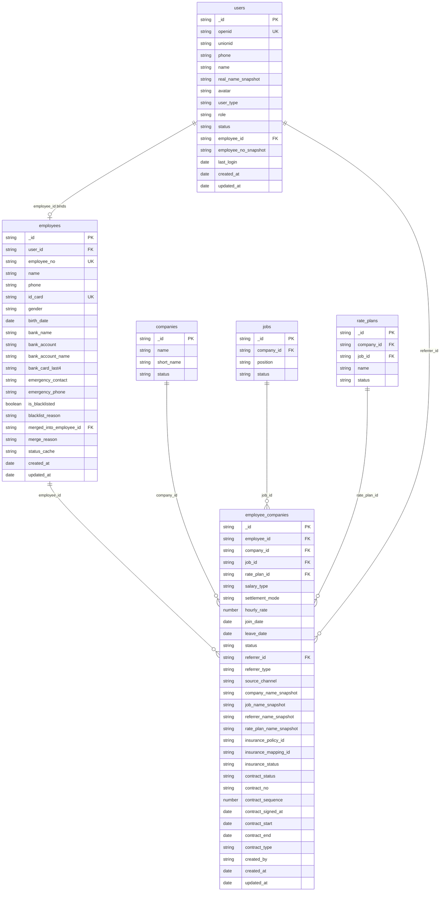
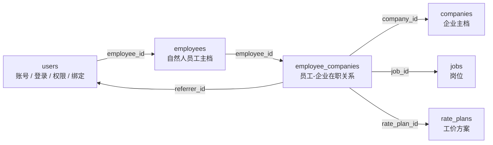
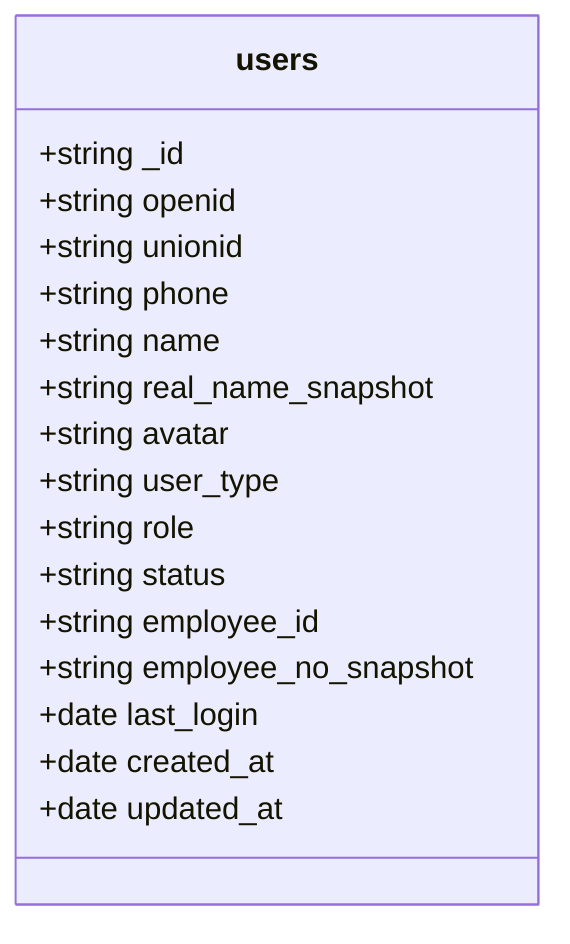
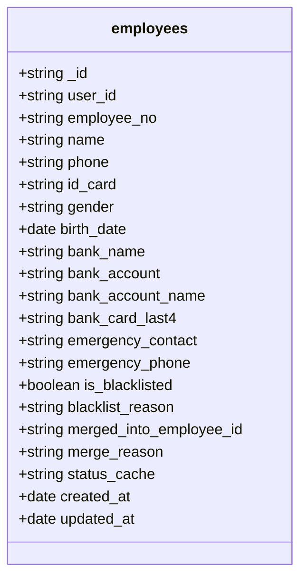
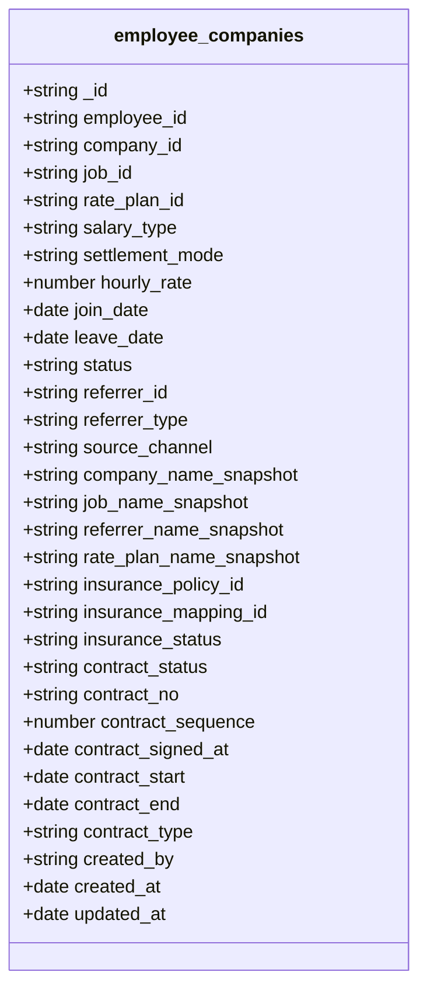
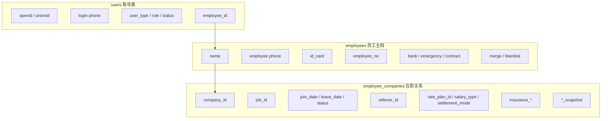

# 用户、员工、在职关系数据库设计图

更新时间：2026-05-14

## 1. 总体关联图

## 2. 三表职责边界

## 3. `users` 字段图

定位：小程序和 Web 端统一账号表。

| 字段 | 归属说明 |
| --- | --- |
| `_id` | 用户账号主键 |
| `openid` | 微信小程序登录标识 |
| `unionid` | 微信开放平台统一标识 |
| `phone` | 登录手机号，不作为员工主档手机号 |
| `name` | 昵称或展示名 |
| `real_name_snapshot` | 实名快照，兼容展示 |
| `avatar` | 头像 |
| `user_type` | `candidate` / `employee` / `admin` |
| `role` | Web 后台角色 |
| `status` | 账号状态 |
| `employee_id` | 绑定 `employees._id` |
| `employee_no_snapshot` | 员工编号展示快照 |
| `last_login` | 最近登录 |
| `created_at` | 创建时间 |
| `updated_at` | 更新时间 |

## 4. `employees` 字段图

定位：员工自然人主档，一人一档。

| 字段 | 归属说明 |
| --- | --- |
| `_id` | 员工主档主键 |
| `user_id` | 绑定 `users._id` |
| `employee_no` | 员工编号 |
| `name` | 员工真实姓名 |
| `phone` | 员工主手机号 |
| `id_card` | 员工身份证号 |
| `gender` | 性别 |
| `birth_date` | 出生日期 |
| `bank_name` | 开户行 |
| `bank_account` | 银行账号 |
| `bank_account_name` | 开户名 |
| `bank_card_last4` | 银行卡后四位 |
| `emergency_contact` | 紧急联系人 |
| `emergency_phone` | 紧急联系人电话 |
| `is_blacklisted` | 是否黑名单 |
| `blacklist_reason` | 黑名单原因 |
| `merged_into_employee_id` | 合并后指向保留员工 |
| `merge_reason` | 合并原因 |
| `status_cache` | 由在职关系聚合出的状态缓存 |
| `created_at` | 创建时间 |
| `updated_at` | 更新时间 |

## 5. `employee_companies` 字段图

定位：员工和企业之间的一段在职关系。

| 字段 | 归属说明 |
| --- | --- |
| `_id` | 关系主键 |
| `employee_id` | 指向 `employees._id` |
| `company_id` | 指向 `companies._id` |
| `job_id` | 指向 `jobs._id` |
| `rate_plan_id` | 指向工价方案 |
| `salary_type` | 薪资类型 |
| `contract_status` | 签约状态，`unsigned` / `signed` |
| `contract_no` | 签署合同编号，未签约显示 `-` |
| `contract_sequence` | 企业维度合同流水号 |
| `contract_signed_at` | 人工确认签约时间 |
| `contract_start` | 本段关系合同开始日期 |
| `contract_end` | 本段关系合同结束日期 |
| `contract_type` | 本段关系合同类型 |
| `settlement_mode` | 结算方式 |
| `hourly_rate` | 兼容工价字段，优先从工价方案取 |
| `join_date` | 本段关系入职日期 |
| `leave_date` | 本段关系离职日期 |
| `status` | `active` / `left` / `pending` / `suspended` / `cancelled` |
| `referrer_id` | 推荐人 ID |
| `referrer_type` | 推荐人类型 |
| `source_channel` | 来源渠道 |
| `company_name_snapshot` | 企业名称快照 |
| `job_name_snapshot` | 岗位名称快照 |
| `referrer_name_snapshot` | 推荐人名称快照 |
| `rate_plan_name_snapshot` | 工价方案名称快照 |
| `insurance_policy_id` | 保险方案 ID |
| `insurance_mapping_id` | 保险岗位映射 ID |
| `insurance_status` | 保险状态 |
| `created_by` | 创建人 |
| `created_at` | 创建时间 |
| `updated_at` | 更新时间 |

## 6. 字段归属总览

## 7. 禁止重复写入边界

| 数据 | 主表 | 禁止再主写到 |
| --- | --- | --- |
| 员工姓名 | `employees.name` | `users.name` 只作账号展示或快照 |
| 员工手机号 | `employees.phone` | `users.phone` 只作登录手机号 |
| 身份证号 | `employees.id_card` | `users.id_card` |
| 企业归属 | `employee_companies.company_id` | `employees.company_id` |
| 岗位归属 | `employee_companies.job_id` | `employees.job_id` |
| 入职日期 | `employee_companies.join_date` | `employees.join_date` |
| 离职日期 | `employee_companies.leave_date` | `employees.leave_date` |
| 推荐人 | `employee_companies.referrer_id` | `users.referrer_id`、`employees.referrer_id` |
| 工价方案 | `employee_companies.rate_plan_id` | `employees.rate_plan_id` |
| 展示名称 | 关联查询生成或 `_snapshot` | 不再散落多个 `*_name` 字段 |
